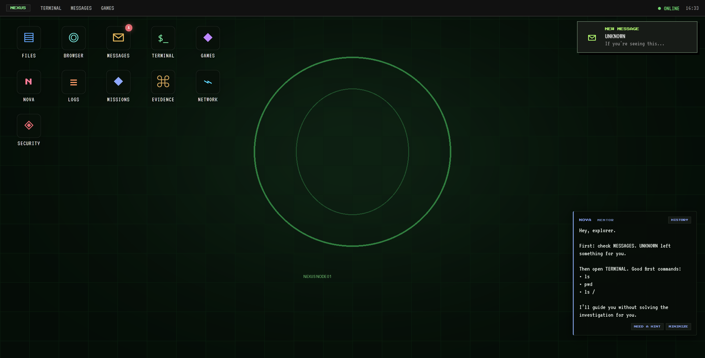
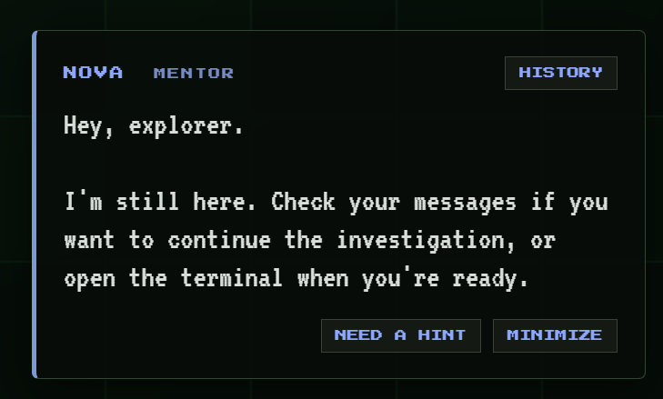
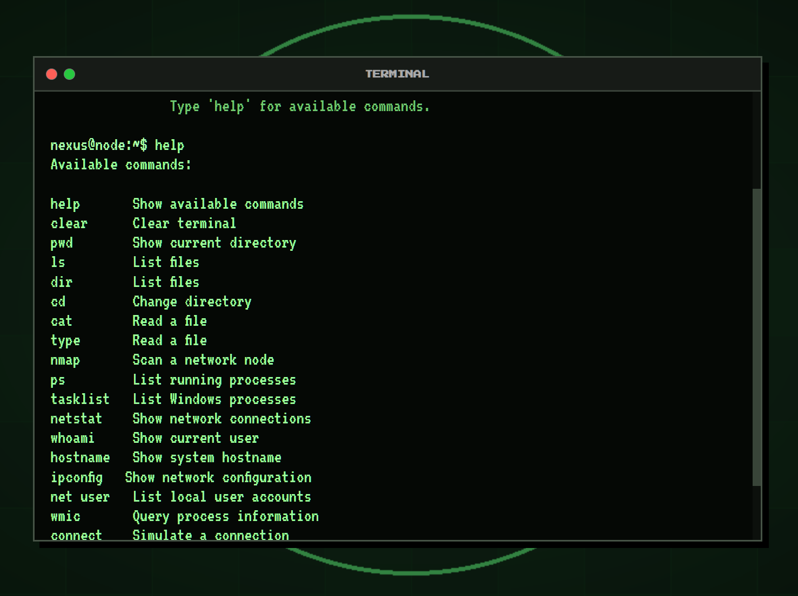
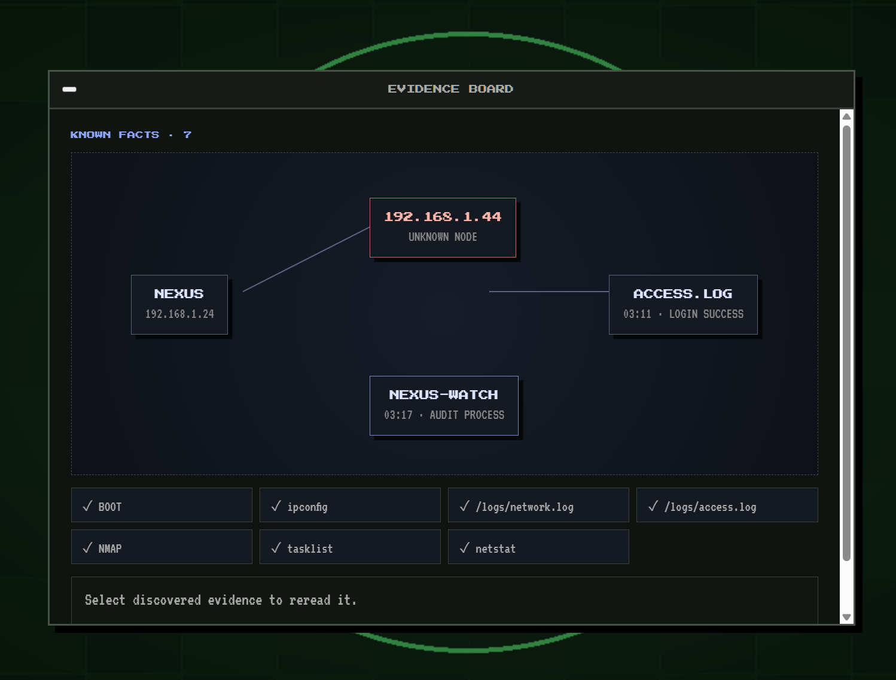

# NEXUS OS
## Introduction

I have always found cybersecurity interesting, but when you are learning it, a lot of the time it is just tutorials and commands. 
So I wanted to try making something where you actually have to investigate instead of just being told what to do. 

NEXUS is a browser based cybersecurity investigation game where you get your own operating system and have to figure out what happened to NEXUS NODE 1.

## The Idea

You start with a suspicious message and have no idea whats going on. 
You use the terminal to check the machine, look through logs, find suspicious network activity and investigate processes. 
Every thing you find gives you another clue and slowly the story starts making sense.

The first chapter follows this general path: 

**Message > Logs > Suspicious IP > NMAP > Processes > Network connections > NEXUS-WATCH > Recovery**

I tried to make it so you actually have to think about what command you should use next 

## NOVA

NOVA is the mentor inside NEXUS. 
She helps you find out where to look, but she doesnt give you the answer. 

For example, instead of telling what command to type, she tell you to look for the Logs folder. 
But If you are still stuck, the hint system gives you a more specific hint.

## The Terminal

The terminal is the main way you investigate the system. 
It has commands like `whoami`, `hostname`, `ipconfig`, `ls`, `cd`, `cat`, `nmap`, `netstat` and `tasklist`. 

## Evidence

Important things you find can be added to the evidence board. 
This lets you go back and look at clues you found earlier instead of trying to remember everything from the terminal.

There is also an investigation trail that shows how the case has developed.

## Try It
You can try the current version here: 

**[Try NEXUS](http://nexus-os-demo.vercel.app)**

The online version is still being worked on, so if it decides to randomly stop working... yeah thats on me 😭

## Tech Stack

NEXUS is made using Python and Flask for the backend, with HTML, CSS and JavaScript for the frontend. 
It is currently hosted on Vercel.

## Why I Made It

I wanted to make cybersecurity learning feel more like actually solving something. 

Instead of:

**"Here is a command. Here is what it does."**

I wanted:

**"Something happened. What can I find out?"**

That was the whole idea behind NEXUS.

## AI Declaration

I used AI during development for some coding help, debugging and research. 
The overall idea, game concept, story, investigation flow and design direction were mine, and I built and changed the project myself.

## Made By

**Abu Bakr**

Still working on it, still finding bugs, and probably still going to add way too many things to a operating system lol.
