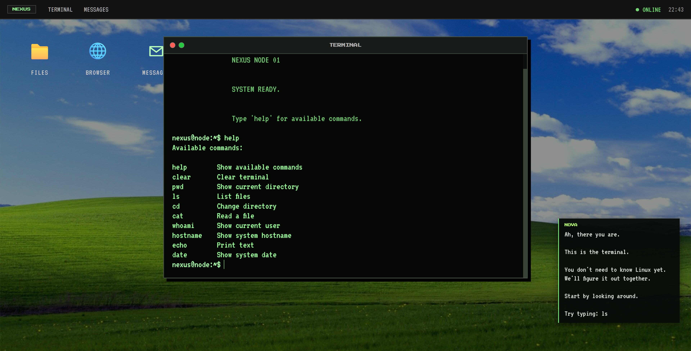
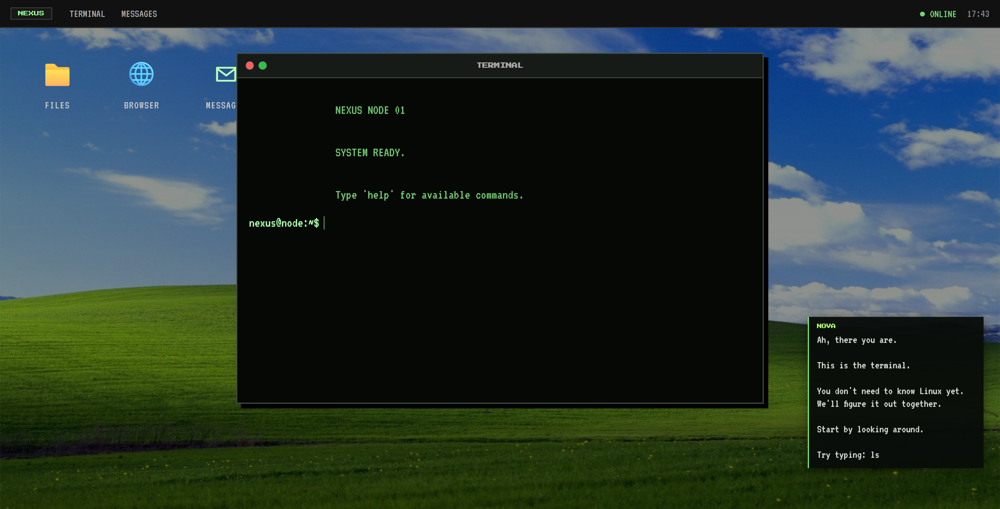
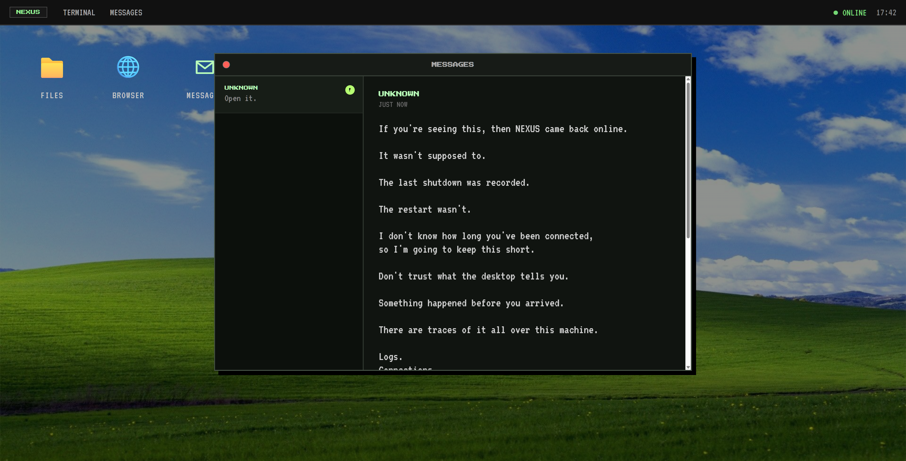
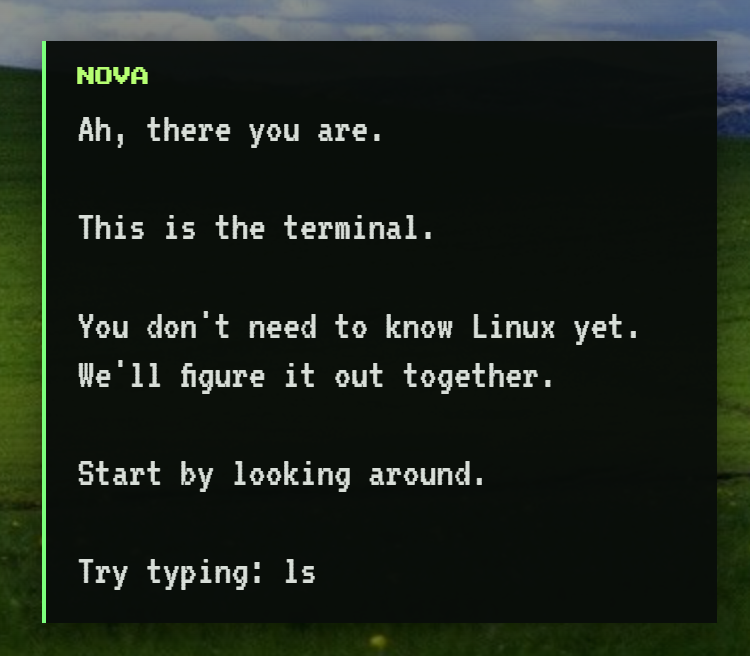
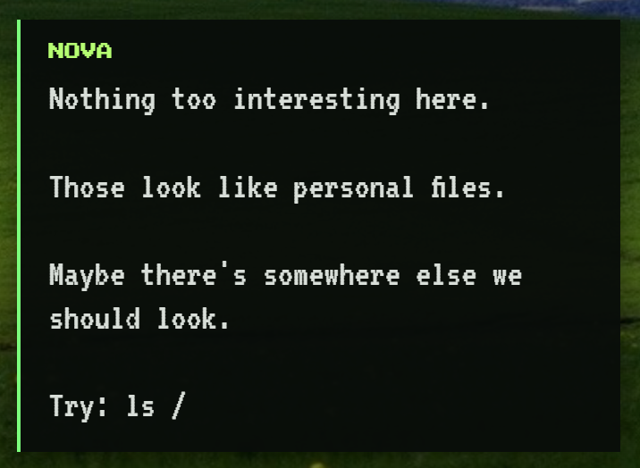

# NEXUS

🌐 Try NEXUS

You can also try the current live version without installing anything locally.

<p align="center"> <a href="https://nexus-os-demo.vercel.app/"> <strong>▶ Try NEXUS Online</strong> </a> </p>

Note: The online version is currently a work in progress and may change as new features and story content are added.

> ### A cybersecurity learning game disguised as an OS.

<p align="center">
  
</p>

<p align="center">
  <strong>Explore. Investigate. Learn.</strong>
</p>

<p align="center">
  A browser-based cybersecurity learning experience built around exploration, investigation, and hands-on challenges.
</p>

---

## 🎮 What is Nexus?

Nexus is a gamified cybersecurity learning platform. Players navigate around a simulated computer, investigate suspicious activity, use a terminal, solve security challenges, and learn real cybersecurity principles via gameplay.

Nexus throws you into the system and lets you figure it out on your own, rather than watching a tutorial and being told what to do.

---

## 🖥️ The Story

You wake up inside **NODE 01**. This is where you are now. You do not know how you got here.

The machine was shut down.. Now it is working again.

Something brought Nexus online. You do not know what it was.

Nexus does not tell you what happened. You have to find out what is going on.

You need to look around Nexus. Explore the filesystem. Inspect the logs.

Investigate what is happening on the network. Read the messages.

Follow the clues left behind by the people who were using Nexus before you.

You have to be careful. Not everything, on Nexus is what it seems to be.

---

# 📸 Showcase

## Nexus OS

<p align="center">
  
</p>

The Nexus desktop acts as the player's main environment.

---

## Terminal

<p align="center">
  
</p>

A Linux-inspired terminal allows the player to interact with the simulated system and investigate its filesystem.

---

## Messages

<p align="center">
  
</p>

Messages from unknown users gradually reveal more of the story as the player progresses.

---

## NOVA

<p align="center">
  
  
</p>

NOVA acts as a friendly guide, helping players understand what they are discovering without simply giving them the answers.

---

# 🕵️ Challenge 01

The first challenge begins with a simple question:

> ## **Who is 192.168.1.44?**

The player isn't immediately given the answer.

Instead, they investigate.

### Investigation Flow

## ⚙️ Setup & Running Locally

### Requirements

* Python 3.10+
* Git
* A modern web browser

### Installation

Clone the repository:

```bash
git clone https://github.com/AbuBakrProjects/Nexus.git
cd Nexus
```

Create and activate a virtual environment:

**Windows:**

```bash
python -m venv venv
venv\Scripts\activate
```

**Linux/macOS:**

```bash
python3 -m venv venv
source venv/bin/activate
```

Install the dependencies:

```bash
pip install -r requirements.txt
```

### Run NEXUS

Start the Flask server:

```bash
python app.py
```

Then open:

```text
http://127.0.0.1:5000
```

NEXUS should now be running locally in your browser.

### Project Structure

```text
Nexus/
├── app.py
├── requirements.txt
├── vercel.json
├── challenges/
├── system/
├── templates/
├── static/
└── docs/
```

`app.py` contains the Flask backend, while `templates/` and `static/` contain the frontend. The `challenges/` and `system/` directories contain the game's challenge and simulated OS components.

```text
                         ┌───────────────┐
                         │     BOOT      │
                         └───────┬───────┘
                                 │
                                 ▼
                     ┌─────────────────────┐
                     │    NEXUS DESKTOP    │
                     └──────────┬──────────┘
                                │
                                ▼
                     ┌─────────────────────┐
                     │   UNKNOWN MESSAGE   │
                     └──────────┬──────────┘
                                │
                                ▼
                     ┌─────────────────────┐
                     │   OPEN TERMINAL     │
                     └──────────┬──────────┘
                                │
                                ▼
                     ┌─────────────────────┐
                     │ EXPLORE FILESYSTEM  │
                     └──────────┬──────────┘
                                │
                                ▼
                               ls
                                │
                                ▼
                              cd /
                                │
                                ▼
                               ls
                                │
                                ▼
                              logs
                                │
                                ▼
                           access.log
                                │
                                ▼
                        192.168.1.44
                                │
                                ▼
                         INVESTIGATE
                                │
                                ▼
                       /etc/network.conf
                                │
                                ▼
                        192.168.1.24
                                │
                                ▼
                     COMPARE THE EVIDENCE
                                │
                                ▼
                     ┌─────────────────────┐
                     │ CHALLENGE COMPLETE  │
                     └─────────────────────┘
